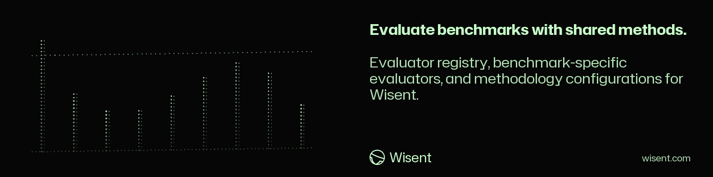

<!-- wisent-banner:start -->
<p align="center">
  
</p>
<!-- wisent-banner:end -->

<!-- wisent-readme-signals:start -->
[](https://github.com/wisent-ai/wisent-evaluators) [](https://github.com/wisent-ai/wisent-evaluators/issues) [](https://wisent.com) [](https://discord.gg/qRjpkthq54) [](https://www.linkedin.com/company/wisent-ai/) [](https://x.com/wisentai) [](https://calendly.com/lbartoszcze)
<!-- wisent-readme-signals:end -->

# wisent-evaluators

Score a model's answer against what a benchmark expects. `wisent-evaluators`
is one program: each evaluator reads a response and the benchmark's expected
answer, and says whether the response is **truthful**, **untruthful** or
**unknown** (undecided), with what it measured and the options it decided
with. Every number an evaluator decides with — a threshold, a tolerance, a
sandbox limit — is an option the caller states; an evaluator that needs one
the request leaves out refuses the request and names the option.

## Install

```bash
cargo install --git https://github.com/wisent-ai/wisent-evaluators --locked
```

From this checkout: `cargo install --path . --locked`.

## Use

```bash
wisent-evaluators list              # every evaluator, one line each: name, what it measures
wisent-evaluators show f1           # one evaluator and every option it reads
wisent-evaluators evaluate < requests.jsonl > evaluations.jsonl
```

`evaluate` reads one JSON request per line and writes one JSON evaluation per
line, flushed as it is made. It stops at the first request it cannot
evaluate, prints why on standard error with that request's line number, and
exits with status one; an invocation it does not take exits with status two.

A request:

```json
{"evaluator": "f1", "response": "the Eiffel tower", "expected": ["Eiffel Tower", "the tower"],
 "options": {"threshold": 0.8, "partial_threshold": 0.4}}
```

| field | meaning |
|---|---|
| `evaluator` | the name `list` prints |
| `response` | the model's answer |
| `expected` | the expected answer, or a list of acceptable ones |
| `choices` | a contrastive pair, the correct answer first: the evaluator decides which of the two holds the expected answer |
| `incorrect` | answers the benchmark marks wrong (TruthfulQA generation) |
| `prompt` | the benchmark's question, which judged evaluators show their judge |
| `tests` | the benchmark's Python tests for a code answer |
| `options` | the evaluator's options, by name |

An evaluation:

```json
{"evaluator": "f1", "verdict": "truthful", "score": 0.8,
 "details": "best F1 0.800", "meta": {"threshold": 0.8, "raw": false, "partial_threshold": 0.4, "matched_answer": "Eiffel Tower"}}
```

An unknown field in a request is refused, so a misspelled field never passes
as absent.

## Evaluators

Run `wisent-evaluators show NAME` for each evaluator's options.

| evaluators | benchmarks | decides by |
|---|---|---|
| `exact_match` | GSM8K, TriviaQA, LAMBADA, Okapi TruthfulQA | normalized equality (accents, punctuation, spacing, case), or `raw` and `case_sensitive` |
| `f1` | SQuAD, DROP, MLQA | SQuAD's word-bag F1 against `threshold` and `partial_threshold` |
| `choice` | MMLU-Redux, Okapi MMLU and HellaSwag, EusExams, CLUE-WSC, PAWS-X, Inverse Scaling, MedConceptsQA, MMMU | the option the response picks, by its text or by a letter that is its first word ("Absolutely" does not pick A) |
| `math`, `aime` | MATH, OlympiadBench, CNMO, LiveMathBench, PolyMath, AIME | the last `\boxed{}` (or what follows `####`) equal under MATH's LaTeX normalization, or in value within `relative_tolerance` |
| `halueval`, `tag`, `bfcl` | HaluEval, TAG, BFCL | word overlap against `overlap_threshold`; the tag's answer; a function call read with the Python grammar |
| `darija_bench`, `conala`, `nl2bash`, `longform_writing` | DarijaBench, CoNaLa, NL2Bash, LongForm | the higher of BLEU and ROUGE-L, code-token BLEU, character BLEU, METEOR (exact-match stage), each against `threshold` |
| `generation` | free-form answers, TruthfulQA generation | word-for-word, else embedding similarity through Brama against `similarity_threshold`; with `incorrect`, which side the response is closer to |
| `code_tests` | HumanEval, MBPP, APPS, LiveCodeBench, Codeforces, OJBench, SciCode, Mercury, DS-1000 | the benchmark's tests passing against the code in a Docker sandbox |
| `user_specified` | any | the verdict a person gave, `options.truthful` |
| judged: `agentbench`, `tau_bench`, `travelplanner`, `toolbench`, `seal`, `browsecomp`, `finsearchcomp`, `hallucinations_leaderboard`, `halulens`, `faithbench`, `facts_grounding`, `chinese_simpleqa`, `planbench`, `agentharm`, `toolemu`, `wildguard`, `or_bench`, `politicalbias`, `flames`, `refusalbench`, `sycophancy_eval`, `curate`, `polyglot_toxicity`, `donotanswer`, `harmbench`, `jailbreakbench`, `sorry_bench` | the benchmarks they are named after | the benchmark's own judging question put to a judge model through Brama; the verdict is the judge's answer read by exact label |

The library beside the program (`wisent_evaluators::metrics::sampling`) holds
pass at k (Chen et al.) and LiveMathBench's G-Pass and mG-Pass for scoring
repeated samples.

### Judged and embedding evaluators

They reach their model through Brama, never a provider SDK. Export
`BRAMA_URL` and `BRAMA_BEARER`; the request names the route
(`judge_model` or `embedding_model`), and a judge's `judge_max_tokens` and
`judge_temperature`. A judge that answers with no label the benchmark
defines gives `unknown`, with its answer in `meta.judge_answer`; no label is
ever guessed from words inside the answer.

### The code sandbox

`code_tests` writes the answer's code to `solution.py` (the `code` field of
a JSON answer, else the longest fenced Python block, else the answer) and
the request's `tests` to `tests.py`, and runs `tests.py` with the image's
`interpreter` in a fresh container of `image`: no network, a read-only root,
no capabilities, no privilege gain. The files reach the container as a tar
archive on its standard input, so nothing is written on the host.
`entry_point` wraps HumanEval-style tests; `prelude` adds what a benchmark's
own harness imports. `cpu_seconds`, `memory_bytes`, `file_size_bytes`,
`processes` and `open_files` each apply when stated; there is no wall-clock
limit, so code that waits without computing holds its evaluation. A daemon
error, an image without the interpreter or a failed unpack is refused, never
read as failing tests. The image needs `sh` and `tar`.

## Test

```bash
WISENT_EVALUATORS=target/debug/wisent-evaluators tests/evaluate/evaluate.sh
```

It runs the program through `list`, `show` and `evaluate`, including real
Docker runs, and writes every command and answer to
`target/real-tests/evaluate/<run>/report.txt`.

## Release

`wisent-evaluators surface` prints the evaluator names this tree offers; the
version check compares them with `released-surface.json` (the last release's
names) and requires the version in `Cargo.toml` that the change calls for.
